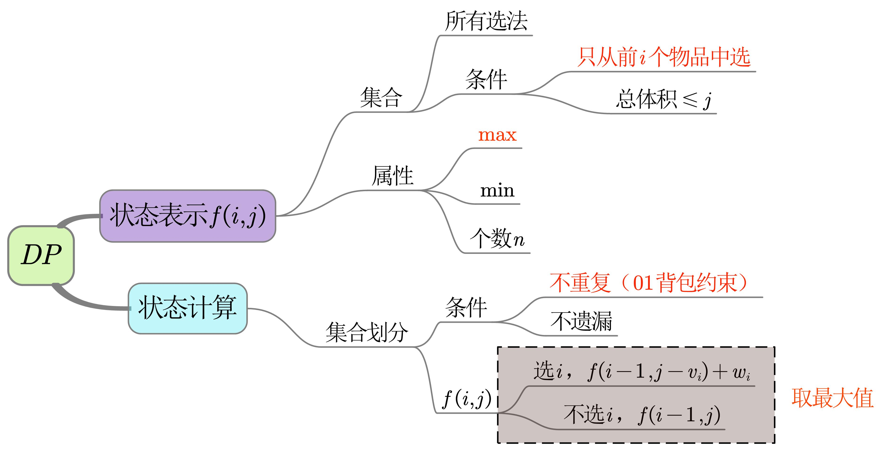
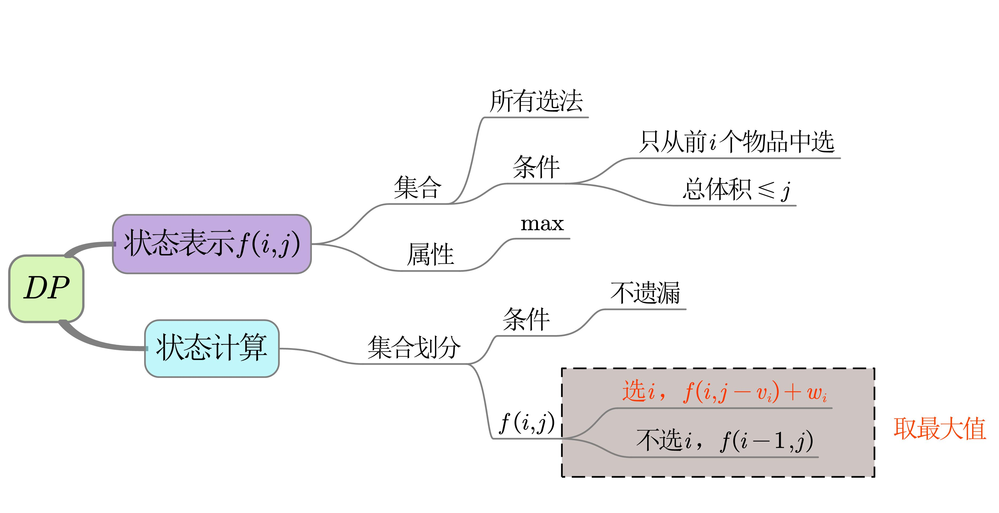

<!--
 * @Description: 
 * @Language: 
 * @Author: 
 * @Date: 2020-10-28 12:35:55
-->
从集合的角度思考dp问题


# 1.最大子序和
-2 1 -3 4 -1 2 1 -5 4
求出所有字段的和的最大值
暴力做法：枚举所有的起点和终点


寻找某种状态，用这个状态代表一类东西


# 2.数字三角形   路径最小   2^(n-1)
   [2]
  [3,4]
 [6,5,7]
[4,1,8,3]

# 3.不同路径
f[i][j] = f[i-1][j] + f[i][j-1];


# 4.解码方法91


# 最长不下降子序列  最长上升子序列
# 最长回文子串
if s[i-j] s[i+1-j-1]


11.01背包
12.完全背包  优化


线性dp
区间dp
背包问题


最大子序和
最长公共子序列
最长上升子序列
最长回文子串
数字三角形
不同路径
01背包
完全背包


# 01背包

n个物品，每个物品的体积是vi，价值是wi，背包的容量为m

若**每个物品最多只能装一个**，且不能超过背包容量，则背包的最大价值是多少？

#### 模板

```c++
int n;
int m;
int v[N];
int w[N];
//  二维形式  未优化
int f[N][M]; // f[i][j]表示在考虑前i个物品侯，背包容量为j条件下的最大价值
for (int i=1; i<=n; ++i) {
    for (int j=1; j<=n; ++j) {
        if (j < v[i]) f[i][j] = f[i-1][j];
        else f[i][j] = max(f[i-1][j], f[i-1][j-v[i]]+w[i]);
    }
}
cout << f[n][m];
// 一维形式
int f[M];// f[j]表示背包容量为j条件下的最大价值
for (int i=1; i<=n; ++i) {
    for (int j=m; j>=v[i]; --j) {
        f[j] = max(f[j], f[j-v[i]]+w[i]);
    }
}
cout << f[m] << endl;
```

### 说明

- 注意`f[i][j]`的含义是：在考虑前i个物品侯，背包容量为j条件下的最大价值，而不是表示选了`i`个物品的最大价值，实际上选择的物品数`<=i`。f[j]表示背包容量为`j`条件下的最大价值
- 二维压缩成一位，实际上是寻找避免写后读错误的方法
  - `f[i][j]始终只用上一行数据f[i-1][...]`更新（迭代更新的基础，如果还需要用上上行数据则不可压缩）
- `f[i][j]始终用靠左边的数据f[i-1][<=j]`更新，决定了只能倒叙更新
- 显然i=0时，`f[i][j]=0`，而初始化时自动赋值为0，故不必单独处理第0行





# 完全背包




假设背包容量为j时，最多可以装入k个物品i，则有：

f(i，j) = max{f(i-1,j),  f(i-1,j-vi)+wi,  f(i-1, j-2vi)+2wi,  f(i-1, j-3vi)+3wi,  f(i-1, j-3vi)+3wi, ... , ,  f(i-1, j-kvi)+kwi}

考虑

f(i, j-vi) = max{f(i-1,j-vi),  f(i-1, j-2vi)+2wi,  f(i-1, j-3vi)+3wi,  f(i-1, j-3vi)+3wi, ... , ,  f(i-1, j-kvi)+kwi}

f(i, j) = max{f(i-1, j), f(i, j-vi)+wi}

```c++
nt n;              // 物品总数
int m;              // 背包容量
int v[N];           // 重量 
int w[N];           // 价值

// ---------------二维形式---------------
// 未优化
int f[N][M];    // f[i][j]表示在考虑前i个物品后，背包容量为j条件下的最大价值
for (int i = 1; i <= n; i++)
    for (int j = 1; j <= m; j++)
        for (int k = 0; k * v[i] <= j; k++)
            f[i][j] = max(f[i][j], f[i - 1][j - k * v[i]] + k * w[i]);


// 已优化
int f[N][M];    // f[i][j]表示在考虑前i个物品后，背包容量为j条件下的最大价值
for(int i = 1; i <= n; ++i) 
    for(int j = 1; j <= m; ++j)
        if(j < v[i]) f[i][j] = f[i-1][j];   //  当前重量装不进，价值等于前i-1个物品   
        else f[i][j] = max(f[i-1][j], f[i][j-v[i]] + w[i]); // 能装，需判断  
cout << f[n][m];

// ---------------一维形式---------------
int f[M];   // f[j]表示背包容量为j条件下的最大价值
for(int i = 1; i <= n; ++i) 
    for(int j = v[i]; j <= m; ++j)
        f[j] = max(f[j], f[j - v[i]] + w[i]);           // 注意是倒序，否则出现写后读错误
cout << f[m];           // 注意是m不是n

```

